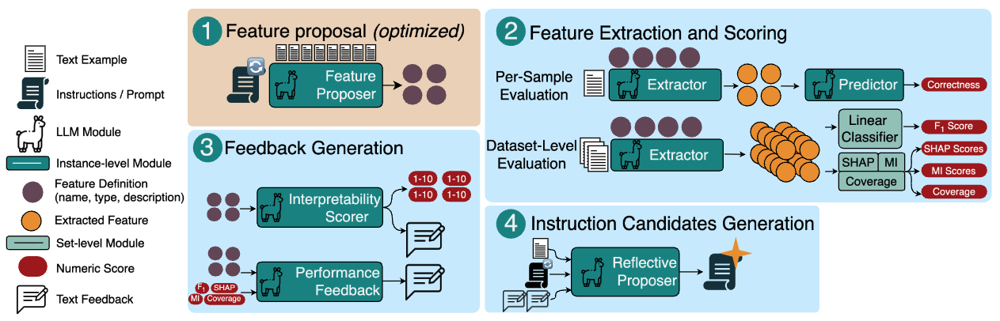

<h1 align="center"><span style="font-weight:normal">Automatic Prompt Optimization for Dataset-Level Feature Discovery</h1>

<div align="center">

[Adrian Cosma](https://scholar.google.com/citations?user=cdYk_RUAAAAJ&hl=en), [Oleg Szehr](https://scholar.google.com/citations?user=Yiie6xUAAAAJ&hl=en&oi=ao), [David Kletz](https://scholar.google.com/citations?user=9nTkji8AAAAJ&hl=en&oi=ao), [Alessandro Antonucci](https://scholar.google.com/citations?user=0uOsJggAAAAJ&hl=en&oi=ao), Olivier Pelletier
</div>

<div align="center">

[Arxiv PDF 📜](https://arxiv.org/abs/2601.13922) | [Abstract](#intro) | [Code](#code) | [Citation](#citation) | [License](#license)
</div>

 <!--  -->
<div align='center'>
    
</div>


## <a name="abstract"></a> Abstract
Feature extraction from unstructured text is a critical step in many downstream classification pipelines, yet current approaches largely rely on hand-crafted prompts or fixed feature schemas. We formulate feature discovery as a dataset-level prompt optimization problem: given a labelled text corpus, the goal is to induce a global set of interpretable and discriminative feature definitions whose realizations optimize a downstream supervised learning objective. To this end, we propose a multi-agent prompt optimization framework in which language-model agents jointly propose feature definitions, extract feature values, and evaluate feature quality using dataset-level performance and interpretability feedback. Instruction prompts are iteratively refined based on this structured feedback, enabling optimization over prompts that induce shared feature sets rather than per-example predictions. This formulation departs from prior prompt optimization methods that rely on per-sample supervision and provides a principled mechanism for automatic feature discovery from unstructured text.


## <a name="code"></a> Code

Example usage:

```bash
PARAMS="--group yahoo-qwen3-4b --proposer_llm Qwen/Qwen3-4B --n_iters 32 --demo_rounds 16 --bags 16 --annotation_set_size 512 --validation_size 128 --temperature 0.75 --max_examples_per_bag 16 --num_examples_per_class_train 16 --num_threads 4"

python main.py \
    --dataset ugursa/Yahoo-Finance-News-Sentences \
    --name bag-correctness-interp-fb \
    --optimizer bag-mipro-feedback \
    --evaluator bag-correctness-interpretability-feedback \
    --seed 42 \
    --dont_train_sampler \
    $PARAMS
```

## <a name="citation"></a> Citation
```
@misc{cosma2026apofeaturediscovery,
      title={Automatic Prompt Optimization for Dataset-Level Feature Discovery}, 
      author={Adrian Cosma and Oleg Szehr and David Kletz and Alessandro Antonucci and Olivier Pelletier},
      year={2026},
      eprint={2601.13922},
      archivePrefix={arXiv},
      primaryClass={cs.CL},
      url={https://arxiv.org/abs/2601.13922}, 
}
```

## <a name="license"></a> License

This work is protected by [Attribution-NonCommercial 4.0 International](LICENSE)